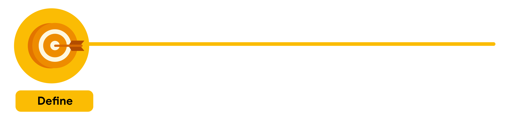

# SEMANA 1
##  VIDEO - Bienvenido a la semana 1

 1. Veremos cómo funciona el programa.
 2. Definiremos qué es el diseño de UX y por qué es importante para consumidores y empresas.
 3. También veremos los diferentes roles en el sector de la UX
 4. Qué factores definen una buena o mala experiencia.
 4. Qué hacen los diseñadores de UX de nivel básico
 4. Cómo trabajan con equipos multidisciplinarios
 4. Cómo varían los trabajos de diseño de UX según la industria y el tamaño de la empresa y cómo empezar a trabajar en diseño de UX. 
 
 ---
## [Aspectos básicos del diseño de la experiencia del usuario](https://www.coursera.org/learn/aspectos-basicos-del-diseno-de-la-experiencia-del-usuario-ux/lecture/OeyQC/aspectos-basicos-del-diseno-de-la-experiencia-del-usuario)
  - #### La experiencia de usuario es importante para los consumidores y las empresas.
  - #### La **UX "experiencia de usuario"** es la forma que un usuario se siente cuando interactúa con un producto o lo experimenta.
  - #### Para una buena experiencia de usuario, el producto debe ser:

    1. **Fácil de usar:** diseño, estructura y la finalidad del producto deben estar claros para todos.  Un diseñador de UX debe pensar en las distintas personas que usaran el producto, por ejemplo personas con discapacidad o personas que viven en distintas condiciones.

    2. **Equitativo**: Esto significa que el diseño sea útil y accesible para personas con diversas discapacidades y  antecedentes. Tener en cuenta las necesidades de personas diferentes es muy importante.

    3. **Agradable**: Los productos deben ser agradables al uso, crear una conexión positiva entre el usuario y el producto, para esto el diseñador UX tiene que tener en cuenta que piensa y siente el usuario. Para ello se realiza una _investigación_, se recopila pruebas de como el usuario experimenta al producto en tiempo real y se le pregunta al respecto.
    4. **Útil**: Como cualquier ser humano necesitamos y queremos productos que resuelvan nuestros problemas.

#### Básicamente todo esto reduce a que si un usuario le gusta un producto, este lo recomendara a sus amigos, por lo cual la empresa tendrá mejores negocios, a su vez la compañía creadora del producto tendrá una buena impresión/imagen ante el cliente. Todo este resulta un gran beneficio tanto para el consumidor como para las empresas.
---
 

## [PARTE 3: Trabajos en el campo de la experiencia del usuario](https://www.coursera.org/learn/aspectos-basicos-del-diseno-de-la-experiencia-del-usuario-ux/lecture/0yONp/trabajos-en-el-campo-de-la-experiencia-del-usuario)

## Los diferentes roles dentro del diseño UX y Colegas de trabajo. ##
#### Algunas características de los diseñadores UX:
- Tienen curiosidad por la gente y como piensa.
- Disfruta saber como usa la gente algún producto y como puede mejorarlo, más fáciles de usarlo.
- Son empáticos,esto consiste en entender qué sienten o piensan los demás, esto es una parte importante de la UX. Básicamente diseñar para todos, pensar como se sentiría un usuario ante una situación dada.
- Muchos aprende de manera autodidacta para adquirir las destrezas y habilidades
- Son bastantes ingeniosos usan sus experiencias laborales y pasatiempos para implementarlo en los diseños.

>diseño: Actividad creativa que tiene por fin proyectar objetos que sean útiles y estéticos.

#### El diseño no es solo los aspectos estéticos de un producto. Hay Varios tipos de diseñadores en UX: 

- **Diseñadores de interacción:** diseñan la experiencia del producto y como funciona. Conectan la necesidad de los usuarios y los objetivos comerciales con lo que es factible construir.
- **Diseñadores visuales:** Centrados en como se vera el producto. Diseñan el logotipo, ilustraciones o iconos, deciden el color, tamaño de fuente o la disposición del producto.  
- **Diseñadores movimiento:** piensan en que sienten el usuario al utilizar el producto y cómo crear transiciones suaves en la web.

## Diseñadores gráficos VS Diseñadores UX
#### ***diseñadores gráficos*** crean elementos visuales que cuentan una historia o transmiten un mensaje, también trabajan en la apariencia física de un producto.
#### ***Diseñadores UX:*** Se centran en cómo interactúan los usuarios con el producto.
 

#### Colegas con que los un diseñador se relaciona en el ambiente laboral:
- ***Investigadores UX:*** realizan estudios y entrevistas a los usuarios.
- ***Luego están los escritores UX:*** se encargar de escribir textos claros en los productos y que sean intuitivos para el usuario.
- ***Diseñadores de producción:*** Son el "puente" entre los diseñadores de interacción y los ingenieros, se encargan de que el diseño inicial y final coincidan con el material  y que cuenten con los recursos(texto, imágenes y especificaciones de diseño como el estilo, color, tamaño, y el espaciado de la fuente) la hora de entregarlo al equipo de ingeniería.
- ***Ingenieros de diseño:*** traducen intención del diseño en una experiencia funcional, como una app.
- ***Gerentes de programas UX:*** proponen una comunicación clara y oportuna, para que el proceso de construcción de un producto útil avance sin problemas de principio a fin.  define objetos y redacta planes de proyectos.
---
---
---
 

## [ ** PARTE 4: Carreras profesionales en el campo de la experiencia del usuario** ](https://www.coursera.org/learn/aspectos-basicos-del-diseno-de-la-experiencia-del-usuario-ux/supplement/7o3K0/carreras-profesionales-en-el-campo-de-la-experiencia-del-usuario)

#### El diseño UX es un campo que cambia rápidamente y tiene una tasa de cambio de crecimiento proyectada a 10 años del 15%(Burning Glass)

## **Diseñador de interacción / interaction designer**

- ####  Ellos se encargan de diseñar la experiencia del producto y como funciona. Comprenden el *flujo del usuario* (la ruta que se realiza para ejecutar una tarea). ***Son un tipo especializado de diseñador de UX***

#### Algunas de las preguntas que responde el diseñador de interacción :
  - ¿Qué debería ocurrir si un usuario toca este botón?
  - ¿Cómo hacemos que realizar esta acción sea mas fácil para los usuarios?
  - ¿Cómo se presentan los elementos de diseño dentro del sitio web?

#### Objetivo del *"interaction designer"*: no se encargan tanto de la apariencia sino, más bien, de como se puede hacerlo mas fácil de navegar e interactuar.

 

## **Diseñador Visual / Visual designer**

- #### Ellos se centrar en cómo se ve un producto/una tecnología.Pueden diseñar logotipos, ilustraciones e íconos -> pueden decidir el color, tamaño y ubicación de la fuente.  
- #### Se centran en el diseño de una pagina/pantalla de una web para que sea agradable y atractiva a la vista.
#### Algunas preguntas que responde el Visual designer son:

  -  ¿Qué tipo de estilo visual deben tener los íconos para que se ajusten a las directrices de marca del producto?
  - ¿Qué color y fuente debemos usar en este botón?
#### Objetivo del *Visual designer*: deleitar al usuario con diseños que los ***inspiren, atraigan y entusiasmen***. Son un tipo especializado de diseñador de UX.

 

## **Diseñador de movimiento / Motion Designer**
- #### Analizan al usuario que siente ante el desplazamiento del producto
- #### Como crear transiciones fluidas en app/web
- #### Crean animaciones o efectos visuales para dar vida a sus ideas de diseños 
- #### Son un tipo especializado de diseñador de UX.

#### El Motion Designer responde preguntas como:
- ¿Cómo debe ser la transición entre distintas páginas de una aplicación?
- ¿Cómo mostramos la conexión entre estas acciones?
- ¿Cómo podemos crear una animación atractiva que  nos ayude a contar nuestra historia?

#### Objetivo de *Diseñador de movimiento*: Se centran en los en los elementos del diseño con movimiento y NO en los estáticos tradicionales.

 

## **Diseñador de VR/AR (VR/AR designer - realidad virtual y realidad aumentada**)

- #### Los diseñadores de realidad virtual (VR) y realidad aumentada (AR) crean productos que proporcionan al usuario experiencias envolventes que transgreden los límites del mundo físico. 
- #### En la **realidad virtual**, se emplea un visor que reemplaza la visión natural del usuario, bloquea su entorno físico y lo sumerge en un mundo completamente virtual.
- #### La **Realidad aumentada** usa al mundo físico y agrega elementos virtuales a traves de una pantalla. En este caso los usuarios son consientes de su entorno pero si realidad *aumenta* 

#### El VR/AR designer responde preguntas como:
- ¿Cómo podemos crear una experiencia del usuario que aproveche el espacio tridimensional? 
- ¿Podría esta acción marear al usuario?

#### Objetivo del *VR/AR designer*: 
- garantizar que los usuarios se sientan cómodos al sumergirse en la realidad virtual/aumentada 
- Deben tener en cuenta cada detalle, desde el sonido hasta la iluminación.

 

## **Investigador de UX / UX researcher.**

- #### Llevan a estudios/entrevista de como el usuario usa el producto
- #### identifican las dificultades que experimenta el usuario
- #### Como los productos ayudan a resolver las dificultades
- #### Investigan que tan fáciles son de usar los productos.

#### Los *investigadores de UX* responden las siguientes preguntas:
- ¿ Qué problemas enfrenta el usuario?
- ¿ El diseño del producto es fácil de usar?
- ¿ Estaría interesado el usuario en una nueva función al diseño?

#### Objetivos del *UX researcher*: 
- entender como un producto puede resolver un problema real al usuario.

 

## **Escritor de UX / UX writer.**

- #### Hacer texto claro de un producto. Para una experiencia intuitiva.
- #### Ayudan a definir una voz y personalidad de una marca.
- #### Escriben etiquetas de los botones
- #### Determinar el tono de texto de una app/web

#### Los *UX writer* responde preguntas como:
- ¿Qué palabras se deben usar para comunicar esta idea con claridad?
- ¿El tono de esta app debe ser amigable o técnico?
- ¿Qué debería decir la etiqueta de este botón?

#### Objetivos del *"Escritor de UX":* 
  - Presenta el contenido de forma que sea fácil de leer para todos los usuarios.

 

## **Gerente de programas de UX / UX program manager.**

- #### Garantiza una comunicación clara y oportuna para que el proceso de creación de un producto útil avance sin problemas.
- #### Realiza tareas como: 
  - definir objetivos.
  - Redactar planes de proyectos.
  - Asignar los recursos del equipo.

#### Los *UX program manager* responden preguntas como:
- ¿Cuáles son los objetivos generales de este proyecto y cuál es el plan para alcanzarlos?
- ¿Cómo podemos crear y mejorar los procesos dentro del equipo?

#### Objetivos del *UX program manager:*
Trabaja en todos los departamentos para que se cumpla todos los objetivos propuestos para la buena experiencia de usuario  y se tenga en cuenta en todo el ciclo de vida del proyecto

 

## **Ingeniero de UX / UX engineer**

- #### Traducen la intención del en una experiencia funcional, como una app o una web.
- #### Ayudan a los equipos UX a saber si los diseños son intuitivos o técnicamente factibles.

#### Los *ingenieros de UX* responden preguntas como:
- ¿Cómo implementamos cada interacción?
- ¿Cómo implementamos este diseño de forma que se mantenga fiel a su intención original?
- ¿Cómo podemos explorar alternativas para determinar la forma de ofrecer la mejor experiencia al usuario?

#### Objetivos de los *UX engineer:*
  - Materializan el diseño y el desarrollo.
  - Dan vida a productos conceptuales.

 

## **Diseñador de conversaciones / Conversation designer**

- #### Interfaces de conversación, se encuentra en los asistentes virtuales como google assistant,Siri. Sistemas de respuesta de voz, chatbot, sistemas de navegación para automóviles...
- #### Su tarea es lograr conversaciones naturales, fluidas e intuitivas. a traves de la investigación de los usuarios, la psicología, el conocimiento técnico y la lingüística. Así desarrollan el tipo de persona/personalidad de la voz  asi como el flujo y el dialogo de interacción

#### Los *Conversation designer* responde preguntas como:
- ¿Cuál es el texto y el flujo ideal en función de los usuarios del producto, la tarea a realizar y el contexto de la conversación?
- ¿La personalidad del asistente virtual parece genuina y atractiva y refleja los valores de la marca?
- ¿Cómo se integra la conversación con los elementos que se muestra en pantalla?
- ¿Ofrece el asistente virtual una experiencia coherente, fácil de usar y útil en cada paso del proceso?

## **Explora las carreras profesionales en el campo de la UX**
- A la hora de trabajar nos colaboraremos con profesionales enumerados en esta sección para crear productos innovadores y hermosos para la gente le encante utilizar!
---
---
---
 

## Parte 5: video: [El ciclo de desarrollo de un producto](https://www.coursera.org/learn/aspectos-basicos-del-diseno-de-la-experiencia-del-usuario-ux/lecture/47ZzU/el-ciclo-de-desarrollo-de-un-producto#) (parte 1)

#### Partiendo de que el trabajo del diseñador UX es desarrollar un producto, como una app o una web...
#### Analicemos *el ciclo de desarrollo de un producto:*

    Consiste en transformar una idea en realidad.
    Las Tareas dentro del proyecto consisten en diferentes etapas de este ciclo.
    Primero el equipo busca resolver algún problema: desarrollar un producto que de al usuario una buena experiencia.

#### Hay cinco etapas en el desarrollo de un producto:
  1. Lluvia de ideas / BrainStorm
  2. Definición / Define
  1. Diseño / Design 
  1. Prueba / Test
  1. Lanzamiento / Launch
  
### Características de cada etapa:

1. #### Lluvia de ideas:
    - Descubrimiento activo. 
    - Objetivo es generar ideas del usuario y sus principales ideas y desafíos.
    - La investigación del usuario/publico de destino es clave para conocerlos.
    - Los ***investigadores y escritores UX*** son claves en esta etapa, realizan entrevistas al usuario y realizan investigaciones

 

2. #### Definición:
    - Se utiliza los hallazgos de la lluvia de ideas para enfocar el proceso
    - Se identifica formas concretas en las que el producto afectará al usuario
    - Se analizara detalles específicos del producto:
        - A quién esta destinado.
        - Qué debería hacer.
        - Y que características debería tener para obtener éxito.
    - Objetivo principal: esbozar objetivos/problemas que dará respuesta el diseño del producto.

 

3. #### Diseño / Design

    - Como las 2 primeras etapas son de ***Preparación*** y ***Planificación***, comprendemos al usuario, que problemas / desafíos resuelve el diseño.
    - Generamos el diseño centrado en el usuario. Guiones gráficos, Bocetos de exp de usuario, esbozar la distribución del contenido.
    - Crear prototipos, aprobación de la funcionalidad del diseño

 

4. #### Pruebas / Test

    - evaluación del diseño según comentarios de usuarios.
    - Probar el diseño con usuarios reales para enfocarse en ellos, luego en el diseño
    - refinamos,mejoramos y vemos lo interactivo del diseño.
    - Diseñadores UX e ingenieros de front-end interactúan para crear el producto final y satisfaces el usuario.

5. #### Lanzamiento / Launch

    - Lanzar Compartir una version terminada con el publico.(sitio web,google play store etc.)
    - Se seguirá mejorando el diseño según el feedback de los usuarios
    - Se podría volver a repetir el ciclo.
---
---
---
 

## Parte 6: Lectura [El ciclo de desarrollo de un producto](https://www.coursera.org/learn/aspectos-basicos-del-diseno-de-la-experiencia-del-usuario-ux/supplement/Otp7y/el-ciclo-de-desarrollo-de-un-producto) - (Parte 2)

### Cada Producto tiene una serie de pasos específicos.   Esto se denomina **ciclo de desarrollo del producto** y tiene cinco etapas: ***lluvia de ideas***, ***definición***, ***diseño***, ***prueba*** y ***lanzamiento***.

### La etapa del ciclo de desarrollo de un producto en la que más participan los diseñadores de UX es la de diseño. También trabajan con otros miembros del equipo, como investigadores, gerentes de productos e ingenieros, durante todo el ciclo. 

### **El éxito de cada etapa depende de la finalización de la etapa anterior, por lo que es importante respetar el orden.**

 

#### Primera etapa del ciclo de desarrollo 
#### **Lluvida de ideas - BrainStorm.**
- El equipo ya conoce el problema del cliente
- De no conocer el problema del cliente se crea un *lista de problemas* de **punto de partida**
- Los equipos que tienen una diversidad de distintos puntos de vista, como la raza, el género, las destrezas, la estructura familiar, la edad y la etnia, suelen ser más eficaces en la lluvia de ideas. Reúnen muchas experiencias de vida diferentes. 
- Investigar competidores y si existen productos similares.
- Cubrir y resolver problemas actuales
- Investigar a los competidores,usuarios y el producto para detectar problemas de diseño.

 

#### Segunda etapa del ciclo de desarrollo.
#### Define - Definición.

- Reúne a 
  - diseñadores de UX
  - Investigadores de UX
  - Gerentes de programas
  - Directores de productos
- Objetivo: Averiguar las especificaciones del producto.
- Responde a las Preguntas:
    - ¿Para quien es el producto?
    - ¿Qé hará el producto?
    - ¿Qué funciones debería incluir el producto para tener éxito?
- Se debe definir en resolver una idea, un problema especifico.
- El diseñador UX ayuda a enfocar la idea, pero podría ser definida por un *director de producto*.
- Partiendo de la información de la *lluvia de ideas* se debe trabajar no suponiendo los problemas del usuario si no preguntarles directamente.

 

#### Tercera etapa del ciclo de desarrollo.
#### Diseño / Design.

- Momento de brillar como desarrollador UX! Desarrollamos las ideas del producto.
- Dibujamos *esquemas* (bocetos o esbozos del producto).
- Creamos *prototipos* (modelos iniciales de un producto que transmiten su funcionalidad).
- *Escritores de UX* participan en el diseño definiendo como escribir las etiquetas de los botones y textos de los esquemas / bocetos.
- Incluir todas las especificaciones del producto identificadas en la etapa "definición/define"
- Comprobar que las partes del diseño sean intuitivas.
- Cada tarea debe ser fácil de entender.

 

#### Cuarta etapa del ciclo de desarrollo.
#### Test / Prueba.

- Los ingenieros se encargar de desarrollar los prototipos para que sean igual a los diseños originales.
- Comprueban detalles y características. Que los colores, fuentes se ajusten a la marca y podría incluir código.
- *Tip:* Para probar el diseño previamente se podría usar *Figma* o *adobe XD* para crear prototipos.

- Pasan por 3 etapas de prueba:
    - Pruebas internas dentro de la empresa.
    - Revisiones con los interesados.
    - Pruebas externas con los usuarios.

> Interesado:  persona con la que debes trabajar para completar el proyecto o cualquier persona que tenga algún internes en el proyecto sea dentro o fuera de la empresa.

- Las pruebas las debería realizar un *investigador de UX* del equipo:
    - **Prueba del producto internamente:** busca fallas técnicas y problemas de facilidad de uso. son ***"pruebas Alfa"***
    - **Prueba con los interesados:** se asegura que este alineado con la empresa, cumpla los requisitos legales de accesibilidad y sigue las normas gubernamentales de privacidad.
    - **Prueba Externa con usuarios potenciales:** averiguamos si el producto dá una buena experiencia al usuario para que sea:
      - fácil de usar.
      - equitativo.
      - agradable.
      - Útil.
 Esto es conocido como ***Pruebas BETA***

- Indispensable recopilar e implementar comentarios en esta etapa. Si los usuarios se sientes "frustrados" o "confundidos por el producto.
  los diseñadores UX modifican y/o crean nuevas versiones realizando las pruebas nuevamente para que no haya ninguna fricción entre el cliente y el producto.

### IMPORTANTE: el *ciclo de desarrollo de un producto* no es lineal, el equipo debe alternar entre el diseño y las pruebas antes de lanzar el producto.

 

#### Quinta etapa del ciclo de desarrollo.
#### Launch / Lanzamiento.

- #### El producto se presenta al mundo: publicar una app; poner en linea un sitio web; etc.
-  Se promociona el producto, se encarga el equipo de marketing de realizar publicidad y el equipo de soporte se prepara para dar ayuda al usuario.
- #### Los gerentes de programas se reúne con el equipo multidisciplinario para reflexionar sobre el ciclo de desarrollo y hacer preguntas como:
    - ¿Qué cosas funcionaron bien y que podría mejorarse?
    - ¿Se alcanzaron los objetivos?
    - ¿Se cumplieron los plazos?
- Con un producto físico, el *lanzamiento* puede significar el fin del ciclo.
- Con un producto digital, se puede mejorar el diseño, funcionalidad o características del producto. Por lo que se vuelve a trabajar sobre las fases de diseño para diseñar una nueva version.
---
---
---
 

## Parte 7 Video: [Diseñar para una buena experiencia del usuario](https://www.coursera.org/learn/aspectos-basicos-del-diseno-de-la-experiencia-del-usuario-ux/lecture/NAe5U/disenar-para-una-buena-experiencia-del-usuario)

- Predecir los obstáculos de los usuarios y los posibles contratiempos es clave para un buen diseño de UX.
- Como diseñadores, tenemos que pensar en cómo mejorar la experiencia del usuario.
-  Un buen diseño tiene en cuenta las necesidades del usuario. Para que el usuario tenga una buena experiencia, el producto debe ser ***fácil de usar, equitativo, agradable y útil***, entre otras cosas.
- Para ofrecer una buena experiencia de usuario, un producto debe ser intuitivo y fácil de usar.
- Cada producto debe estar diseñado para hacer que el usuario se sienta de cierta manera. 
- Una tarea clave de los diseñadores de UX es asociar una emoción específica a la experiencia de usar el producto.
---
---
---
 

## Parte 8 [Características de una buena experiencia del usuario](https://www.coursera.org/learn/aspectos-basicos-del-diseno-de-la-experiencia-del-usuario-ux/supplement/IXXnj/caracteristicas-de-una-buena-experiencia-del-usuario)

### En un video anterior, «Aspectos básicos del diseño de UX», Estas características de un producto —fácil de usar, equitativo, agradable y útil— pueden ayudarte a evaluar el diseño.

 

#### **Fácil de usar / Usable.**

>  ***fácil de usar:*** significa que el diseño, la estructura y el propósito del producto son claros y que el producto es fácil de entender. 
- Preguntas para evaluar que tan *fácil es usar* es un producto:
  - ¿Todas las partes del diseño son fáciles de encontrar? 
  - ¿Es fácil entender la funcionalidad del diseño? 
  - ¿Pueden los usuarios realizar tareas específicas dentro del diseño?

 

#### **Equitativo / equitable.**

> Producto equitativo: diseño útil para personas con diversas capacidades y antecedentes.

- el diseño del producto responde a las necesidades de un público diverso y garantiza una experiencia de alta calidad a todos los usuarios.
- La equidad consiste en proporcionar a las personas las herramientas que necesitan para alcanzar sus objetivos y tener una mejor calidad de vida.
- Preguntas para evaluar la *equidad* de la UX de un producto:
  - ¿Se tienen en cuenta las necesidades de un grupo diverso de usuarios?
  - ¿Aborda el diseño del producto las necesidades de los grupos tradicionalmente subrepresentados y excluidos?

 

#### **Agradable / enjoyable.**

> *agradable:* significa que el diseño deleita al usuario.

- El diseño refleja lo que el usuario piensa o siente y crea una conexión positiva con él.
- Si bien el diseño no hará que el producto funcione correctamente pero lo acompaña y lo complementa y brinda al usuario una mejor sensación sobre la experiencia.
- Preguntas para evaluar que tan *agradable* es la UX de un producto:
  - ¿Hay aspectos del diseño que tengan en cuenta los sentimientos del usuario? 
  - ¿El diseño deleita al usuario?
  - ¿El diseño mantiene la atención del usuario durante toda su experiencia? 

   

  

  #### **Útil / Useful.**
  
  > *Útil/Useful:* significa que resuelve los problemas de usuario.

- Resuelve intencionalmente un problema del usuario que el identificado ha identificado.
- *"util"* y *"fácil de usar"* tiene conceptos relacionados pero son diferentes.
- ***"fácil de usar":*** el producto funciona bien y es simple de usar.
- ***"util":*** específicamente resuelve los problemas al usuario.
- Preguntas para evaluar que tan ***útil*** es la ux de un producto:
  - ¿El diseño añade valor a la experiencia del usuario? 
  - ¿Soluciona el diseño un problema del usuario? 
  - ¿El diseño ayuda al usuario a alcanzar un objetivo específico?

 

- [artículo sobre el buen diseño del equipo de Google Design para descubrir la genialidad detrás del diseño de objetos cotidianos que quizás hayas pasado por alto.](https://design.google/library/good-design/)
---
---
---
 

